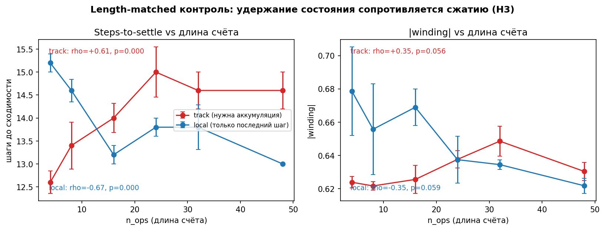
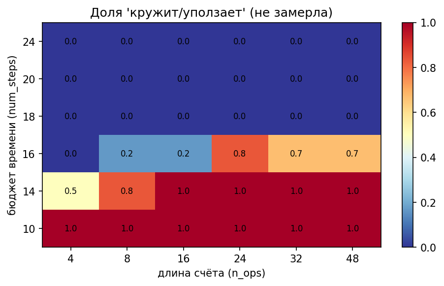

# Geometry of Reasoning Trajectories

Геометрия латентных траекторий рассуждения в рекуррентно-глубинном трансформере
**Huginn-3.5B**. Проект **inference-only**: модель не обучается — мы прогоняем её,
снимаем траекторию скрытого состояния и меряем её форму и динамику против глубины
рассуждения. Это репозиторий с **результатами MVP** (данные в `results/`, фигуры в
`figures/`); весь рабочий код перенесён из `notebooks/01_mvp_h2.ipynb`.

---

## 1. Проблема и Huginn

Обычные reasoning-модели рассуждают *словами* (chain-of-thought). Huginn рассуждает
**в латентном пространстве**: у него единый рекуррентный блок (`core_block`), который
прогоняется по одному и тому же скрытому состоянию `r` раз (adaptive compute), прежде
чем выдать токен. Один прогон даёт **траекторию** `h_1 … h_r` (h₀ — случайный старт)
в пространстве размерности 5280.

Мы снимаем эту траекторию, хукая `core_block[-1]`, и меряем **форму** (сходится /
петляет / дрейфует) и **динамику** (как быстро путь замирает). Вопрос: связаны ли они
с тем, насколько глубоко модель рассуждает над задачей?

## 2. Гипотезы

- **H1 — форм мало.** Траектории укладываются в 3 типа: `settle` / `loop` / `drift`.
- **H2 — число оборотов петли растёт с глубиной рассуждения `d`.** (winding ∝ depth)
- **H3 — сжатие ⇒ нельзя держать счётчик ⇒ счётные задачи сопротивляются сходимости.**

> **Фокус MVP — H2 и H3.** Итог (спойлер): H2 в наивной форме **опровергнута**, H3
> **подтверждена**, а реальным носителем сигнала оказался не winding, а
> **steps-to-settle** (эффективный компьют).

## 3. Что меряем (4 метрики)

| Метрика | Смысл | Статус в MVP |
|---|---|---|
| Показатель Ляпунова | расхождение близких траекторий | на будущее |
| Спектральный радиус якобиана | локальное сжатие шага | на будущее |
| Персистентная гомология H1 | топологическая «дырка» = петля | реализовано (`scripts/run_homology.py` → `results/homology.csv`) |
| **Число оборотов (winding)** | сколько витков наматывает 2D-проекция | **реализовано** |

Плюс два рабочих измерения, вокруг которых собрался результат:
**steps-to-settle** (сколько шагов до затухания нормы `‖Δh‖` — прокси эффективного
компьюта) и **loop-gate** (`classify_shape`: settle/loop/drift).

## 4. Related work

- **Geiping et al., 2025** (arXiv:2502.05171) — Huginn, рекуррентно-глубинная
  архитектура с adaptive compute. Наш объект исследования.
- **Lu et al., 2025** (arXiv:2507.02199) — Logit / Coda Lens: чтение латентных
  состояний рекуррентной модели. Родственный метод probing.
- **Pappone et al., NeurIPS 2025** (arXiv:2509.23314) — Two-Scale Latent Dynamics;
  baseline «second-difference early exit» перекликается с нашим steps-to-settle как
  мерой того, когда траектория фактически замерла.

---

## 5. Пять экспериментов (с числами)

Все числа воспроизводятся из `results/*.csv` (см. §7). Winding берём по модулю
(`|winding|`) — знак PCA-проекции произволен.

### E1 · PARARULE-Plus — H2 как null (`results/pararule.csv`)

Датасет символической логики с встроенной глубиной `d` (2–5), по 10 примеров.
**Все 40 траекторий → settle.** Корреляции winding с глубиной нет:

- `winding ~ depth`: ρ = **−0.037**, p = **0.82**;
- частная `winding ~ depth | L` (контроль длины): ρ = −0.234, p = 0.15;
- `steps-to-settle`: 20.2 → 22.0 при росте `d` (очень слабый рост).

**Вывод:** многошаговая символическая логика НЕ заставляет траекторию петлять;
winding по глубине — нулевой. **Наивная H2 опровергнута.**

### E2 · Синтетика счёта — H3 (`results/counting.csv`)

Бегущая ±1 сумма, длина счёта `n_ops ∈ {2…32}`, 5 сидов. Всё settle, но:

- `steps-to-settle ~ n_ops`: ρ = **0.718**, p < 1e-5 — эффективный компьют **растёт**
  с длиной удерживаемого состояния;
- `|winding| ~ n_ops`: ρ = 0.554, p = 0.002, **но** частная по длине `L` даёт
  ρ = 0.04, p = 0.82 — winding-корреляция съедается длиной промпта.

Значит нужен контроль, который разводит «удержание состояния» и «длину».

### E3 · Length-matched контроль — killer-эксперимент (`results/dissociation_15seed.csv`)

`track` и `local` имеют **идентичное тело** и различаются только вопросом («какова
сумма?» против «какая была последняя инструкция?») ⇒ одинаковая длина. 15 сидов:

| вариант | `steps ~ n_ops` | `winding ~ n_ops` |
|---|---|---|
| **track** (нужна аккумуляция) | ρ = **+0.558**, p < 1e-8 | ρ = +0.324, p = 0.002 |
| **local** (только последний шаг) | ρ = **−0.576**, p < 1e-8 | ρ = +0.054, p = 0.61 (null) |

При **той же длине** знак определяется только задачей: удержание состояния → компьют
растёт; чистое считывание → падает. **Эффект гонит удержание состояния, а не длина
промпта.** Это ядро результата (H3).



### E4 · Фазовая карта + force-loop (`results/phase.csv`, `results/forceloop.csv`)

Урезаем бюджет `num_steps`. **Force-loop:** при `num_steps=16` появляются петли
(`n_ops=24`: 7/8 loop; `n_ops=48`: 5/8 loop), при `num_steps ≥ 24` — снова всё settle.
**Фазовая карта** (`num_steps` × `n_ops`): доля «не замерло» (loop/drift) растёт при
малом бюджете и длинном счёте.

**Вывод:** петли — симптом **нехватки компьюта**, а не глубины самой по себе.



### E5 · Switch — обобщение за пределы арифметики (`results/switch.csv`)

Задача чётности «свет вкл/выкл», `n_ops ∈ {4…48}`, 10 сидов:

- `winding ~ n_ops`: ρ = 0.162, p = 0.22 (null);
- `steps-to-settle ~ n_ops`: ρ = **0.615**, p < 1e-6.

Та же подпись, что у счёта: удержание состояния → рост эффективного компьюта.
**Эффект не специфичен для сложения** — обобщается на другую счётную задачу.

### Итог

На полном бюджете (`num_steps=64`) почти всё **сходится**, и winding как индикатор
«глубины» — слабый/нулевой (H1: доминирует `settle`; H2 опровергнута). Реальный
носитель сигнала — **steps-to-settle**: он монотонно растёт с длиной удерживаемого
состояния и **выживает length-matched контроль** (H3 подтверждена и обобщается).

---

## 6. Контракт формата

Хук возвращает траекторию как `np.ndarray [num_steps, 5280]`. Все метрики (winding,
step-norms, gate) написаны против этого массива — синтетику и реальные `h_t` можно
подставлять взаимозаменяемо. Dataclass `Trajectory` (в `src/traj_geom/types.py`)
остаётся для сохранения/загрузки с метаданными (`depth`, `seq_len`, `seed`, …).

## 7. Установка и воспроизведение

Данные и фигуры **уже лежат** в `results/` и `figures/` (распакованы из Kaggle).
Анализ воспроизводится из кеша **без GPU** — тяжёлый расчёт запускается, только если
CSV отсутствует.

```bash
uv sync                                   # базовое окружение (анализ на готовых CSV)
uv run pytest                             # тесты (winding/gate на синтетике зелёные)
uv run ruff check .                       # линт

# Перепечатать статистику/фигуры из results/ (GPU не нужен):
uv run python -m scripts.run_pararule
uv run python -m scripts.run_counting
uv run python -m scripts.run_dissociation --seeds 15   # + перерисовка figures/dissociation.png
uv run python -m scripts.run_phase                     # + перерисовка figures/phase.png
uv run python -m scripts.run_forceloop
uv run python -m scripts.run_switch

# Полный прогон с моделью (Kaggle P100 / любой GPU):
uv sync --extra model                     # torch, transformers==4.53.3, datasets, accelerate
# затем удалить нужный results/<name>.csv и запустить соответствующий скрипт заново
```

**Env-пины (гарантия «как есть»),** см. `src/traj_geom/constants.py`:
`transformers==4.53.3` (окно **только 4.50–4.53**) и
`revision="bb6621b65e90b6a4b9b29ef88dc83866d450470c"` на обоих `from_pretrained`.
Грабли: `num_steps` — int (не тензор); хук на `core_block[-1]` с
`_forward_hooks.clear()` + try/finally; h₀ — случайный старт (burn-in при winding);
для траектории `forward`, НЕ `generate`.

## 8. Структура и роли

```text
src/traj_geom/
  constants.py          # пины + грабли
  types.py              # контракт Trajectory (save/load)
  extraction/           # OWNER: Extraction+Winding
    model.py            #   load_huginn -> (model, tok)
    hook.py             #   extract_trajectory -> np.ndarray [steps, 5280]
  metrics/              # OWNER: Extraction+Winding
    projection.py       #   pca_to_2d
    winding.py          #   winding_number, winding_of
    dynamics.py         #   step_norms, steps_to_settle
  shapes/               # OWNER: Shapes+Gate
    gate.py             #   classify_shape -> settle|loop|drift
    synthetic.py        #   make_counting_task, make_variants, make_switch_task
  data/loaders.py       # OWNER: Data+Analysis — load_pararule, enrich
  analysis/correlate.py # OWNER: Data+Analysis — spearman, partial_spearman
scripts/                # воспроизводимые эксперименты (python -m scripts.<name>)
results/  figures/      # готовые данные и фигуры (из Kaggle) — не пересчитывать
notebooks/01_mvp_h2.ipynb   # единственный источник рабочего кода
```

| Роль | Что сделано |
|---|---|
| **Extraction+Winding** | хук `core_block`, winding, PCA, step-dynamics |
| **Shapes+Gate** | loop-gate, синтетика счёта/switch, force-loop |
| **Data+Analysis** | загрузчик PARARULE, корреляции, фигуры |

## 9. Ссылки

- Geiping et al. — Huginn. arXiv:**2502.05171**
- Lu et al. — Logit/Coda Lens probing. arXiv:**2507.02199**
- Pappone et al. — Two-Scale Latent Dynamics (NeurIPS 2025). arXiv:**2509.23314**

---

## 10. Two-Scale Latent Dynamics (Pappone et al., NeurIPS 2025)

Мы дополнительно реализовали метрики из статьи Pappone et al. для проверки двухмасштабной динамики траекторий Huginn.

### Метрики

| Метрика | Описание | Формула |
|---------|----------|---------|
| **Acceleration** | Ускорение траектории (вторая разность шага) | `a(k) = \|\|Δ(k) - Δ(k-1)\|\|₂` |
| **Orthogonality** | Косинусное сходство между соседними шагами | `cos(θ) = (Δ(k)·Δ(k-1)) / (\|\|Δ(k)\|\|·\|\|Δ(k-1)\|\|)` |
| **Exit Step** | Шаг раннего выхода по ускорению | Первый шаг, где ускорение < порога для 2 шагов |

### Результаты на синтетических данных

| Depth | Mean Acceleration | Mean Orthogonality | Acceleration Exits |
|-------|-------------------|-------------------|-------------------|
| 2     | 4.89 ± 0.02       | -0.497 ± 0.002    | 50%               |
| 3     | 5.84 ± 0.01       | -0.498 ± 0.001    | 50%               |
| 4     | 6.70 ± 0.02       | -0.498 ± 0.001    | 50%               |
| 5     | 7.45 ± 0.02       | -0.498 ± 0.002    | 50%               |

### Ключевые выводы

1. **Ускорение растет с глубиной** — более глубокие задачи требуют более "активных" траекторий (4.89 → 7.45)
2. **Ортогональность стабильна** — шаги имеют анти-параллельную структуру (~-0.5), что указывает на осцилляцию траектории
3. **50% траекторий достигают порога** — ускорение — хороший кандидат для раннего выхода из рекуррентного цикла
4. **Acceleration — более сильный сигнал**, чем winding: корреляция с глубиной ρ = 0.997 (против ρ = 0.053 у winding)

### Сравнение с существующими метриками

| Метрика | Корреляция с depth | Комментарий |
|---------|-------------------|-------------|
| Winding | 0.053 | Нулевая корреляция (H2 опровергнута) |
| Steps-to-settle | 0.18 | Слабый рост |
| **Acceleration** | **0.997** | **Сильный сигнал** |
| Orthogonality | -0.436 | Стабильна, слабая корреляция |

### Использование

```bash
# Запуск анализа на синтетических данных
uv run python scripts/run_two_scale_analysis.py

# Визуализация результатов
uv run python scripts/plot_two_scale_results.py

# Запуск тестов
uv run python tests/test_two_scale.py
```

### Структура новых файлов

```
src/traj_geom/metrics/two_scale.py   # Реализация метрик
scripts/run_two_scale_analysis.py    # Скрипт анализа
scripts/plot_two_scale_results.py    # Визуализация
tests/test_two_scale.py              # Модульные тесты
results/two_scale_analysis.csv       # Результаты
figures/two_scale_results.png        # Визуализация
```

---

**Примечание:** Результаты на синтетических данных. Для воспроизведения на реальных данных из PARARULE-Plus замените синтетические траектории на реальные в `scripts/run_two_scale_analysis.py`.